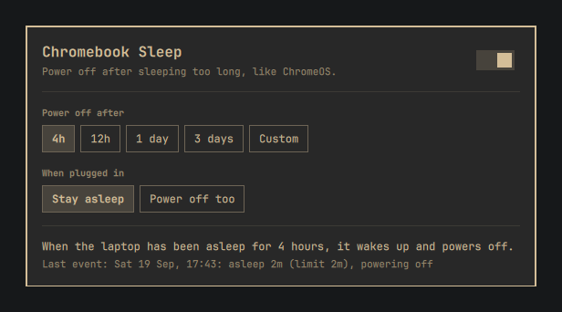

<div align="center">


# Chromebook Sleep

**ChromeOS-style shutdown from suspend, for Omarchy.**

If the laptop stays asleep longer than a time you choose,
it wakes itself, powers off cleanly, and stops draining the battery.

<br>



</div>

## What it does

Close the lid and the laptop sleeps as usual (S3 suspend to RAM), resuming instantly when you
open it. Leave it closed longer than the limit, say 12 hours, and it wakes up by itself and
powers off, so a laptop forgotten in a bag doesn't end up with a flat battery.

This is what ChromeOS does on its own hardware. Its power manager never hibernates: after a set
time asleep it wakes the machine and shuts it down.

### Why not hibernate?

Hibernation (suspend to disk) does the same job when it works. On many Chromebooks running
coreboot/MrChromebox firmware it doesn't. On the Samsung Chromebook 4 this was built on,
the kernel never writes an image and the machine freezes, on every kernel tried. S3 sleep works
well there, so this plugin adds the missing piece, a timed power-off.

It isn't Chromebook-specific: it works on **any Linux laptop whose RTC can wake it from sleep**.

## Install

```bash
omarchy plugin add https://github.com/rbmrs/chromebook-sleep.git --enable --yes
```

Then install the system part, a small sleep hook that needs root. Either open the panel
(**SUPER+SPACE › Chromebook Sleep**) and press **Install**, or run:

```bash
~/.config/omarchy/plugins/io.github.rbmrs.chromebook-sleep/system/setup.sh
```

Setup asks for your sudo password and for how long the laptop may sleep before powering off.

### Check that your laptop can do it

```bash
cat /sys/class/rtc/rtc0/device/power/wakeup   # should print: enabled
sudo rtcwake -m mem -s 60                     # should sleep, then wake by itself after ~60 s
```

If the laptop doesn't wake up by itself, this plugin can't work on it.

## Usage

Open the panel from **SUPER+SPACE › Chromebook Sleep**, or run
`omarchy-shell shell toggle io.github.rbmrs.chromebook-sleep`. Everything in it is also
available from the terminal:

```
chromebook-sleep status [--json]        settings, install state and the last decision
chromebook-sleep set <duration>         e.g. 30m, 8h, 2d (2 minutes to 28 days)
chromebook-sleep enable | disable
chromebook-sleep on-ac skip|poweroff    while plugged in: stay asleep, or power off too
chromebook-sleep test [duration]        try it once with a short limit (default 2m)
```

`test` leaves your settings alone: it makes only the next sleep power off after 2 minutes,
even when plugged in. Close the lid and wait. If the laptop turns itself off, it works.

## How it works

```
lid closes ─► hook "pre":  set an RTC wake alarm for now + limit
                 ... asleep ...
wake       ─► hook "post": clear the alarm
                           slept at least the limit?  ─► power off
                           woke earlier (lid opened)? ─► normal resume
```

- The timer runs once per sleep. Opening the lid early cancels it, and the next sleep starts a
  fresh countdown.
- Only plain suspend is handled. Hibernate and hybrid sleep are left alone.
- **Plugged in:** with `on-ac skip` (the default, as on ChromeOS), no alarm is set while the laptop
  is charging. If you unplug it while it's asleep, it won't power off on that sleep.
- Every decision is logged: `journalctl -t chromebook-sleep`.

Installed files:

| Path | What |
|---|---|
| `/usr/lib/systemd/system-sleep/chromebook-sleep` | the sleep hook |
| `/usr/local/bin/chromebook-sleep` | the CLI |
| `/usr/local/lib/chromebook-sleep/common.sh` | config parsing shared by both |
| `/etc/chromebook-sleep.conf` | settings, `root:wheel 0664` so the panel can edit them without sudo |

## Uninstall

```bash
~/.config/omarchy/plugins/io.github.rbmrs.chromebook-sleep/system/uninstall.sh   # asks about the config
omarchy plugin remove io.github.rbmrs.chromebook-sleep --yes
```

## Troubleshooting

- **See what happened:** `chromebook-sleep status` shows the last decision, including from before
  a power-off. `journalctl -t chromebook-sleep` has the full history.
- **It never powers off:**
  - Check `chromebook-sleep status` says `enabled` and `Hook: installed`.
  - If you're plugged in with `on-ac skip`, that's expected.
  - Run the RTC check above.
- **"invalid config":** the hook treats any bad value as disabled, and `status` names the line.
  Fix it with the CLI or the panel, or re-run `setup.sh`.
- **Sleep hooks must live in `/usr/lib/systemd/system-sleep/`.** systemd-sleep doesn't run hooks
  from `/etc/systemd/system-sleep/`.
- **Developing the panel:** the shell caches compiled QML. After editing `Panel.qml` in a
  symlinked checkout, run `omarchy-restart-shell` to see the change.

## License

MIT
